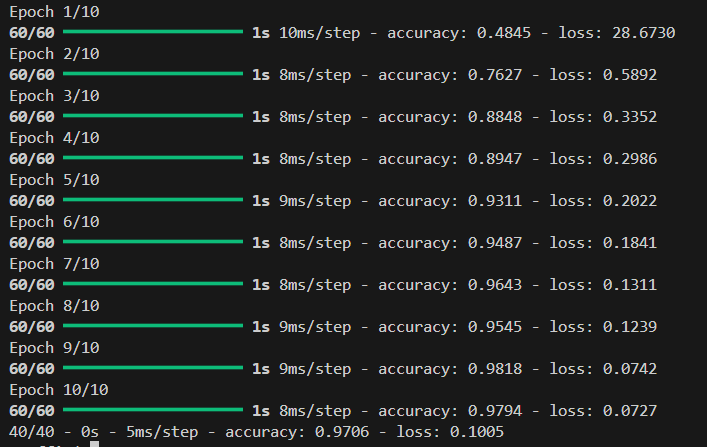
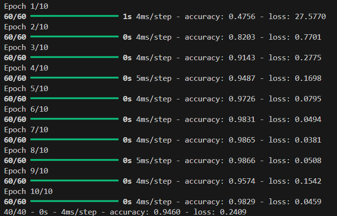
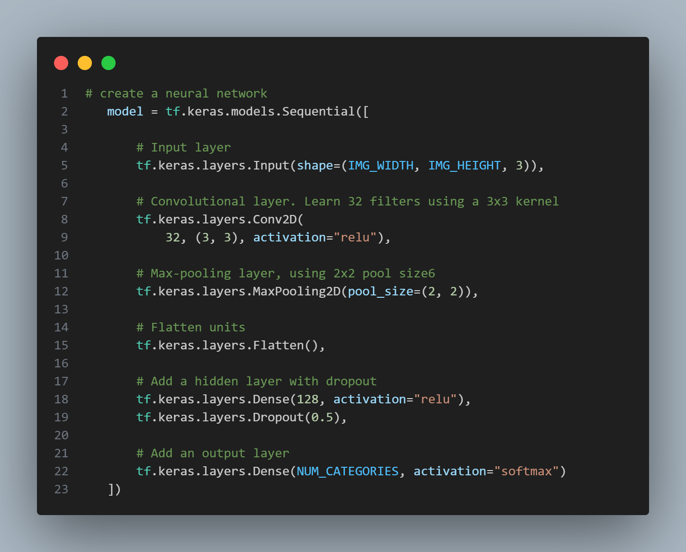
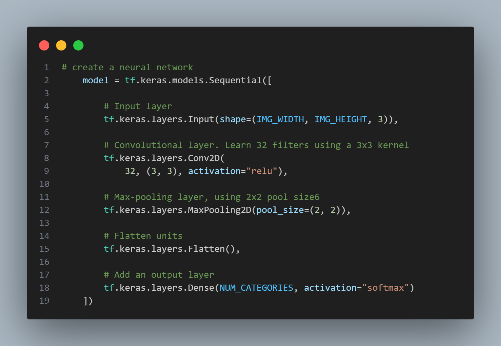

# Traffic  
This is an AI that identifies which traffic sign appears in a photograph.   
  
[German Traffic Sign Recognition Benchmark](http://benchmark.ini.rub.de/?section=gtsrb&subsection=news) (GTSRB) is a collection of images that have already been categorized by the road sign represented in them. Using [TensorFlow](https://www.tensorflow.org/) to build a neural network, the AI will be able to identify the road sign given an image.  
```
$ python traffic.py gtsrb
Epoch 1/10
500/500 [==============================] - 5s 9ms/step - loss: 3.7139 - accuracy: 0.1545
Epoch 2/10
500/500 [==============================] - 6s 11ms/step - loss: 2.0086 - accuracy: 0.4082
Epoch 3/10
500/500 [==============================] - 6s 12ms/step - loss: 1.3055 - accuracy: 0.5917
Epoch 4/10
500/500 [==============================] - 5s 11ms/step - loss: 0.9181 - accuracy: 0.7171
Epoch 5/10
500/500 [==============================] - 7s 13ms/step - loss: 0.6560 - accuracy: 0.7974
Epoch 6/10
500/500 [==============================] - 9s 18ms/step - loss: 0.5078 - accuracy: 0.8470
Epoch 7/10
500/500 [==============================] - 9s 18ms/step - loss: 0.4216 - accuracy: 0.8754
Epoch 8/10
500/500 [==============================] - 10s 20ms/step - loss: 0.3526 - accuracy: 0.8946
Epoch 9/10
500/500 [==============================] - 10s 21ms/step - loss: 0.3016 - accuracy: 0.9086
Epoch 10/10
500/500 [==============================] - 10s 20ms/step - loss: 0.2497 - accuracy: 0.9256
333/333 - 5s - loss: 0.1616 - accuracy: 0.9535
```
## File explanation  
**```gtsrb```**  
This data set contains 43 subdirectories, numbered 0 through 42. Each numbered subdirectory represents a different category (a different type of road sign). Within each traffic sign’s directory is a collection of images of that type of traffic sign.  

**```traffic.py```**  
The ```main``` function accepts as command-line arguments a directory containing the data and (optionally) a filename to which to save the trained model. The data and corresponding labels are then loaded from the data directory and split into training and testing sets. After that, the ```get_model``` function is called to obtain a compiled neural network that is then fitted on the training data. The model is then evaluated on the testing data. Finally, if a model filename was provided, the trained model is saved to disk.  

**The```load data``` function**   
This function accepts as an argument ```data_dir```, representing the path to a directory where the data is stored, and return image arrays and labels for each image in the data set.  

**The ```get_model``` function**  
This function returns a compiled neural network model.  
  
## Experiment: dropout or not
I've tried running the model with and without **a dropout layer of 0.5**, and the result and other details are as below.  
   
| With Dropdown | No Dropdown |
|:----------------------:|:--------------------:|
|  | |
| |  |

First, look at the 10 epochs in the top left image. The accuracy increased stably as more epochs are done, starting from 0.48 to 0.97. Similarly, the model got an accuracy of 0.97 on the testing data set, which is reasonable. 
  
Next, look at the epochs in the top right image. The accuracy seems to be gradually increasing for the first 8 epochs, leveraging from 0.47 to 0.98. However, it endured a sudden decrease in the 9th epoch, lowering to 0.95. The accuracy went back to about 0.98 in the next epoch, but was surprisingly low on the testing data set with an accuracy of 0.94. I surmise that this is due to the happening of overfitting in the 9th epoch. Which is why the model performed really well in the 10th epoch, but rather badly on the testing data set. 
