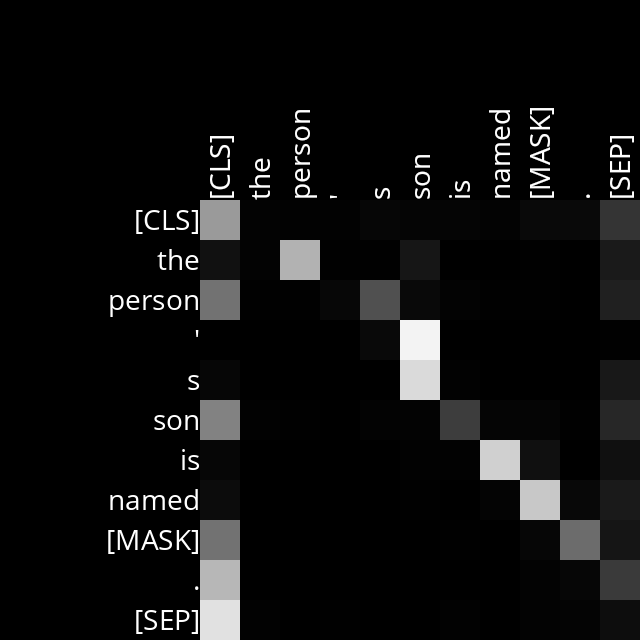
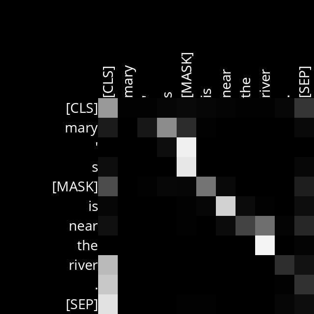
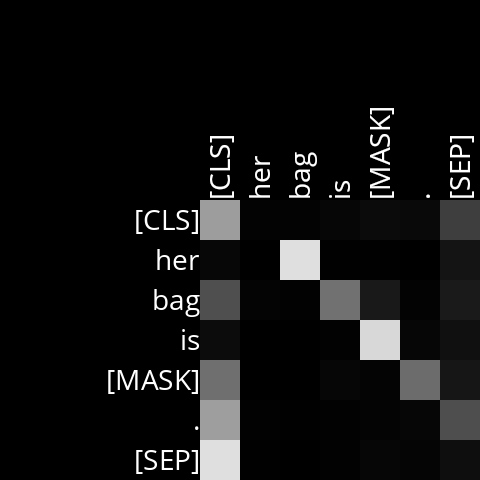
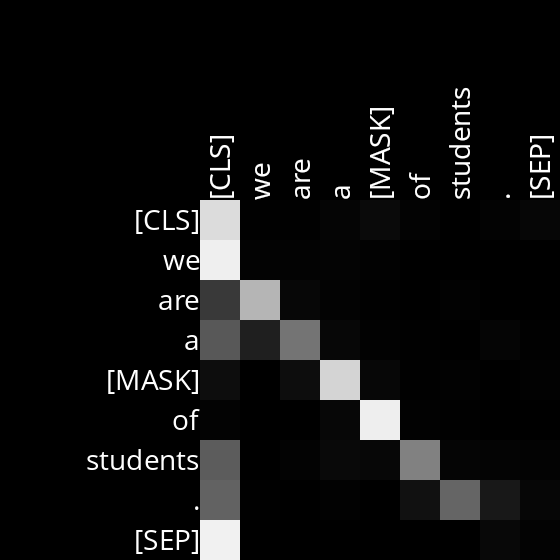
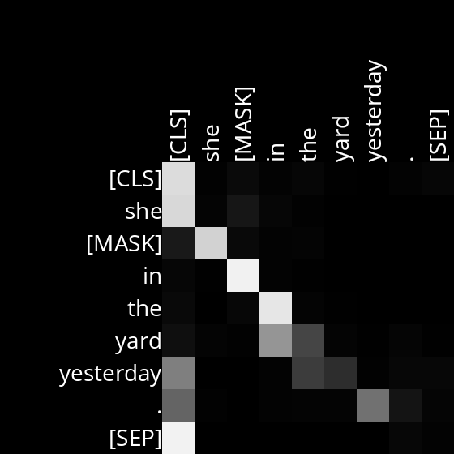

# Attention
This is an AI that predict a masked word in a text sequence.   

```
$ python mask.py
Text: We turned down a narrow lane and passed through a small [MASK].
We turned down a narrow lane and passed through a small field.
We turned down a narrow lane and passed through a small clearing.
We turned down a narrow lane and passed through a small park.

$ python mask.py
Text: Then I picked up a [MASK] from the table.
Then I picked up a book from the table.
Then I picked up a bottle from the table.
Then I picked up a plate from the table.
```

This project uses the ```transformers``` Python library developed by Hugging Face to write a program that uses BERT to predict masked words. The program will also generate diagrams visualizing attention scores, with one diagram generated for each of the 144 attention heads.  

The highlight of this project is my analysis of the attention heads, which is provided below. By looking at the 144 diagrams generated for different sentences, it is possible to make inferences about what role a specific attention head plays in the language understanding process.  

# Analysis

## Layer 4, Head 10: possession
In possessive sentences (sentences that contains the concept of *A belongs to B*), 
this attention head focus on what B is. More precisely, this head looks at the noun (possession) that the possessive pronoun or the genetive marker *'s* refers to. Note that *possessive pronouns* are pronouns that show ownership or possession, such as *his*, *her*, *its* and *their*. 

I've fed some example sentences to prove my hypothesis. Yet, we should first understand how to interpret the diagram. On the right side of the diagram, there are word tokens that serves as our analyzing target. Then, on the top of the diagram are word tokens that the attention head pays attentions to.  

Let's take a look at an example. For diagram 3, *her* is represented by the second row of the diagram. And in that row, *bag* has the lightest color, suggesting that *her* is attending strongly to the word *bag*.

Now, we can look at other possessive sentences that I've tried testing.  

Example Sentences:
- *The person's son is named [MASK]*. (diagram 1)
- *Mary's [MASK] is near the river.* (diagram 2)
- *Her bag is [MASK].* (diagram 3)
- *I did not [MASK] their advice.* (diagram 4)

| diagram 1 | diagram 2 |
| :-------: | :-------: |
|  |  |
| *'s* focuses on *son*. | *'s* focuses on the masked word. |
    
  
| diagram 3 | diagram 4 |
| :-------: | :-------: |
|  |  |
| *her* focuses on *bag*. | *their* focuses on *advice*. |


## Layer 2, Head 5: preceding word
This head focuses on the preceding word of the analyzing target word. For instance, take a look at diagram 5. The first word in the sentence is *we*, and it foucses on the *[CLS]*, which is the starting determiner. The second word in the sentence is *are*, and it focuses on the word *we*, which is the word before it. And the same phonemenon applies for the rest of the word tokens in diagram 5 through 6.

Example Sentences:
- We are a [MASK] of students. (diagram 5)
- She sat on the [MASK] in the park. (diagram 6)
- She [MASK] in the yard yesterday. (diagram 7)

| diagram 5 | diagram 6 | diagram 7 |
| :-------: | :-------: | :-------: |
|  |  | |
